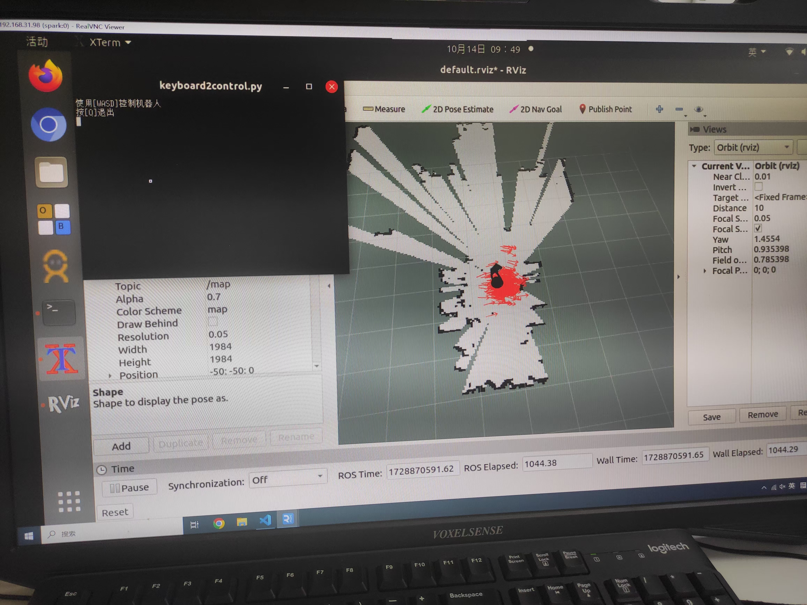

# ROS_SLAM
基于Spark机器人的ROS操作系统SLAM算法

## 项目构成：  
- scripts文件夹下：  
  [keyboard2control.py](./scripts/keyboard2control.py)：使用键盘控制机器人移动，旋转  
- launch文件夹下：  
  - [gmapping.launch](./launch/gmapping.launch)：使用gmapping进行室内地图的绘制  
  - [slam_test.launch](./launch/slam_test.launch)：打开`gmapping.launch`以及其他传感器和底盘控制
  - [map_saver.launch](./launch/map_saver.launch)：保存地图  
  - [map_server.launch](./launch/map_server.launch)：加载已有的地图  
  - [amcl.launch](./launch/amcl.launch)：使用amcl包进行室内定位
  - [amcl_test.launch](./launch/amcl_test.launch)：打开`amcl.launch`的节点，打开`map_server.launch`加载已有的地图以及其他传感器和底盘控制
  - [move_base.launch](./launch/move_base.launch)：启动move_base路径规划
  - [move_base_test.launch](./launch/move_base_test.launch)：打开`move_base.launch`的节点，打开`map_server.launch`加载已有的地图和`amcl.launch`打开定位节点
- map文件夹下：  
  把绘制好的地图文件保存在这里

#### slam绘图
  

